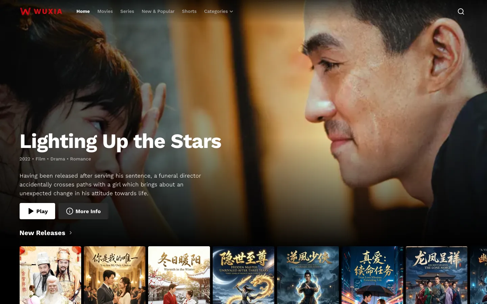

  

<h1 align="center">Wuxia for WordPress</h1>

  A free theme and plugin for a Netflix-style site of Chinese and Hong Kong series and films, 
  in Khmer or English, on a normal WordPress install.

  <a href="https://wuxia-kh.github.io/wuxia-press-published-/"><strong>Website</strong></a>
  ·
  <a href="https://github.com/Wuxia-KH/wuxia-press-published-/releases/latest/download/wuxia-core.zip">Download the plugin</a>
  ·
  <a href="https://github.com/Wuxia-KH/wuxia-press-published-/releases/latest/download/wuxia-theme.zip">Download the theme</a>

  
  
  
  

## What you get

| Download | What it does |
|---|---|
| **`wuxia-core.zip`**, the plugin | The Drama Manager: dramas and episodes (English and Khmer), genres, countries, storage providers for HLS streams behind a signed media address, iVault imports, and **Settings → Site language**. |
| **`wuxia-theme.zip`**, the theme | The front end: billboard and poster rows, Top 10, title pages, an HLS player with subtitles and quality, New & Popular, search, and a Shorts feed. |

## Install

1. Install WordPress as usual.
2. **Plugins → Add New Plugin → Upload Plugin** → `wuxia-core.zip` → Activate.
3. **Appearance → Themes → Add New Theme → Upload Theme** → `wuxia-theme.zip` → Activate.
4. **Settings → Permalinks** → *Post name* → Save.
5. **Drama Manager → Import** (iVault JSON) or **Add drama**; connect storage under **Storage Providers**; pick the language under **Settings**.

Requires WordPress 6.5+, PHP 8.1+ and, for video playback, **nginx** in front of WordPress (below). No Docker or Redis needed. To update, upload the new zips the same way and let WordPress replace the old version. Every release lists `SHA256SUMS`.

## Video playback needs nginx

**Deploying?** Follow [DEPLOY.md](DEPLOY.md): a step-by-step guide for a new Ubuntu server, hosting panels and existing nginx servers, with Cloudflare, checks and troubleshooting.

Every page works on any WordPress host, but episodes only play when nginx serves the site with Wuxia's two media rules. WordPress checks each signed `/media/` link and names the file; nginx fetches it from your storage and streams it, so the storage address and credentials never reach viewers, and PHP never carries video.

1. Copy [`server/nginx-wuxia-media.conf`](https://github.com/Wuxia-KH/wuxia-press-published-/blob/main/server/nginx-wuxia-media.conf): part 1 goes inside `http { }`, part 2 inside your site's `server { }`.
2. Change the two lines marked `CHANGE` (your PHP-FPM address and, on RHEL-family systems, the CA bundle path).
3. `sudo mkdir -p /var/cache/nginx/wuxia && sudo chown -R www-data /var/cache/nginx/wuxia`
4. `sudo nginx -t && sudo systemctl reload nginx`

Apache, LiteSpeed and most shared hosting can't do this: the site shows, but episodes answer `501`. Use a VPS or server with nginx; hosting panels that run nginx (CloudPanel, RunCloud, SpinupWP, Plesk with nginx) accept the rules as custom vhost configuration.

### When an episode won't play

Open the browser's Network tab, play the episode, and look at the `master.m3u8` request.

| Answer | Meaning | Fix |
|---|---|---|
| `501` "Media is served through nginx" | The request reached WordPress without the media rules. | Add the nginx rules above. If your host is Apache or LiteSpeed, move to a server with nginx. |
| `403` "This link has expired" | Media links last six hours. | Reload the page. |
| `404` | The episode or file isn't there. | Check the episode's URL and storage in **Drama Manager**. |
| `429` | Too many requests from one address. | Wait a moment; behind Cloudflare, restore visitor IPs (`set_real_ip_from`) so viewers aren't counted as one. |
| `502` / `503` | Your storage didn't answer, or is busy (Telegram). | Check **Storage Providers**; `503` retries by itself. |

## This repository

This repo holds the website (GitHub Pages, served from `main`) and the release downloads. The theme and plugin are developed elsewhere and published here as zips with each release.

## License

The theme and plugin are free software under the GNU General Public License, version 2 or later (see [LICENSE](LICENSE)). Bundled: hls.js (Apache-2.0) and the Kantumruy Pro font (SIL Open Font License 1.1).
